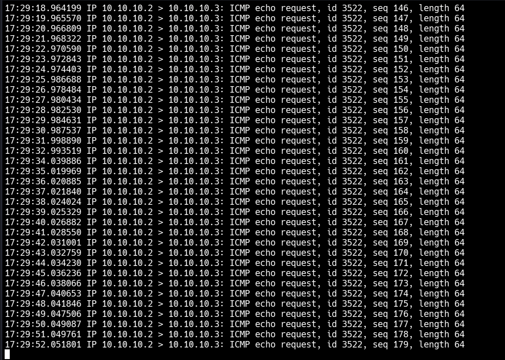
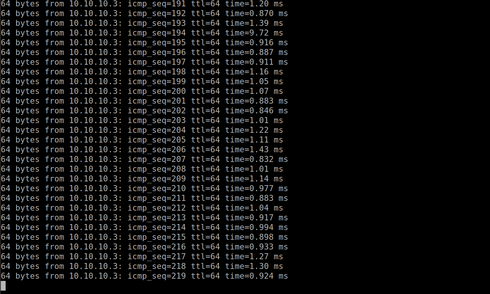
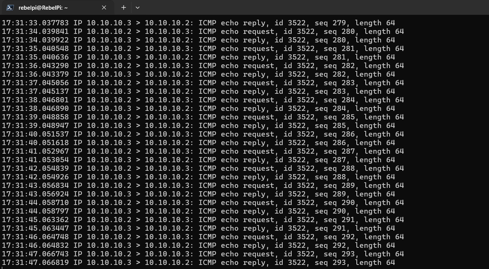

---

## Wireshark / tcpdump Observations

**On Kali (tcpdump eth1 icmp):**
- Ubuntu→Pi ICMP traffic visible on Kali
- Normally switch sends this directly to Pi — Kali should not see it
- After CAM overflow, switch broadcasts — Kali receives it too

**On Raspberry Pi (tcpdump icmp):**
- Both directions visible: Ubuntu→Pi request AND Pi→Ubuntu reply
- Confirms switch is broadcasting all frames to all ports

**CPU impact:**
- mac_flood.py consumed ~73% CPU on Kali
- /tmp filesystem filled to 100% during extended flood
- Wireshark capture files caused tmpfs exhaustion

---

## Key Learnings

**CAM table behavior** — Switch maintains MAC→Port mapping.
When table is full, new MACs cannot be learned — switch falls
back to broadcasting frames to all ports like a hub.

**Random MAC per packet** — Critical for attack to work.
If same MAC is reused, only one CAM entry is consumed.
`src_mac` and `frame` must be inside the while loop.

**Physical vs Virtual switch** — VMware virtual switch has
no CAM overflow behavior. Physical switch required to
demonstrate this attack.

**tmpfs exhaustion** — `/tmp` is RAM-based (tmpfs). Extended
flooding + Wireshark capture can fill it completely.
Fix: `sudo reboot` clears tmpfs on restart.

**IEEE 802.3 — MAC structure:**
- LSB of first byte = 0 → Unicast
- LSB of first byte = 1 → Multicast/Group
- Random MACs may violate this — cosmetic warning in Wireshark

---

## Tools Used
- Python 3, `socket`, `struct`, `random`
- tcpdump (traffic verification)
- D-Link DES-1005C physical switch
- Kali Linux, Ubuntu VM, Raspberry Pi 3B+

---

## Screenshots

---

