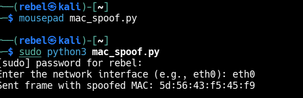
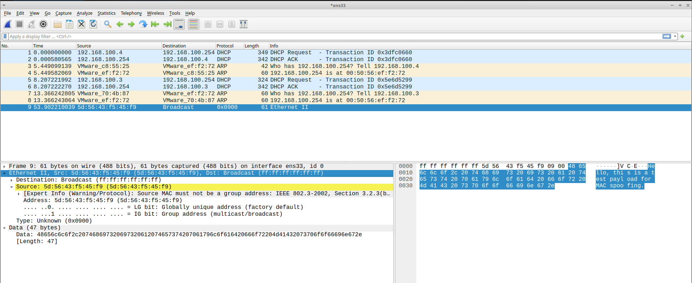

# MAC Spoofing Lab

Manually crafted Ethernet frames with a spoofed source MAC address
using Python raw sockets at Layer 2.

---

## What I Built

A Python script that:
- Generates a random fake MAC address
- Crafts a raw Ethernet frame manually using `struct.pack`
- Sends the frame via `AF_PACKET, SOCK_RAW` socket
- Takes network interface as user input (no hardcoding)

---

## Lab Setup

| Machine | Role | IP |
|---------|------|----|
| Kali Linux VM | Attacker / Sender | 192.168.100.3 |
| Ubuntu VM | Receiver / Observer | 192.168.100.4 |

---

## Wireshark Observations

- Frame captured on Ubuntu with spoofed source MAC `5d:56:43:f5:45:f9`
- Destination: Broadcast `ff:ff:ff:ff:ff:ff`
- EtherType: `0x0900` — custom/unknown type
- Payload visible in hex dump — `"Hello, this is a test payload for MAC spoofing."`

**IEEE 802.3 Warning — Key Learning:**

Wireshark flagged Expert Info warning:
Source MAC must not be a group address (IEEE 802.3-2002, Section 3.2.3)

Reason: Randomly generated MAC `5d:56:43:f5:45:f9` had LSB of
first byte = 1 (`5d` = `01011101`). In IEEE 802.3:
- LSB of first byte = 0 → Unicast (valid NIC address)
- LSB of first byte = 1 → Multicast/Group address

Real NICs always have LSB=0. To generate a valid spoofed unicast
MAC, first byte must be even — LSB forced to 0.

Frame was still delivered and captured — warning is cosmetic,
not a transmission error.

---

## Key Learnings

**Layer 2 spoofing** — Source MAC in Ethernet header is not
validated by the switch — any value can be injected.

**AF_PACKET socket** — Bypasses OS network stack completely,
writes directly to the wire. No IP layer involved.

**IEEE 802.3 MAC structure:**
- Byte 0, bit 0 (LSB) = Individual/Group bit
- Byte 0, bit 1 = Universal/Local bit
- Real vendor MACs have both bits = 0

**Fix for valid unicast MAC:**
```python
def random_mac():
    mac = [random.randint(0, 255) for _ in range(6)]
    mac[0] &= 0xFE  # Force LSB=0 → unicast
    return ':'.join(f'{b:02x}' for b in mac)
```

---

## Tools Used
- Python 3, `socket`, `struct`, `random`
- Wireshark (packet verification on Ubuntu)
- Kali Linux VM, Ubuntu VM

---

## Screenshots



---

