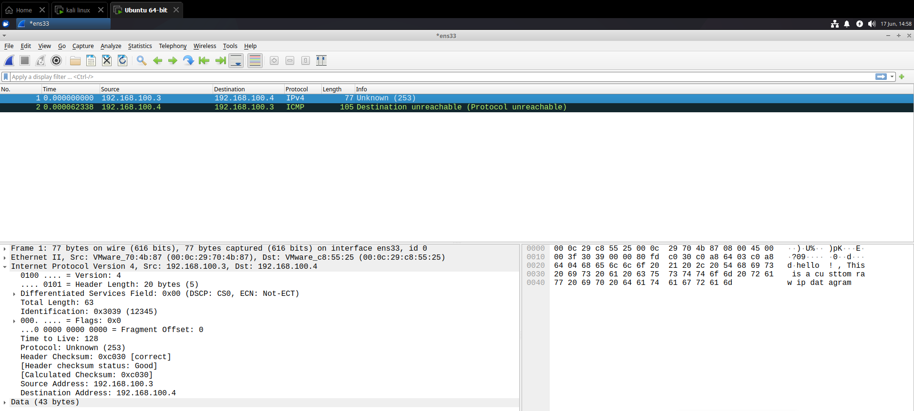
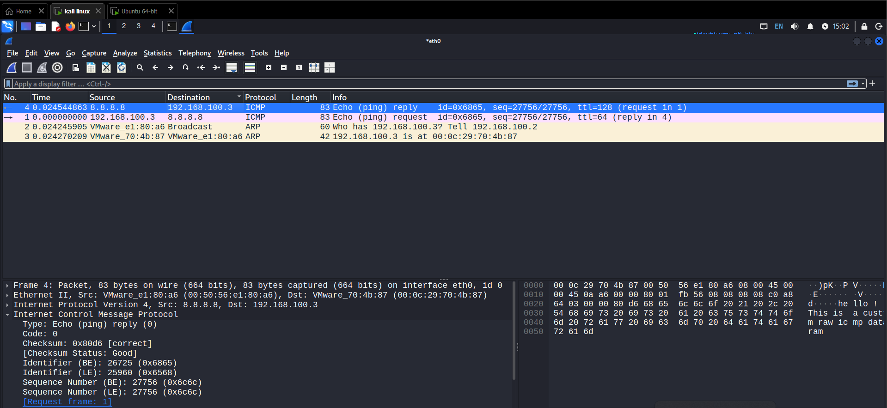

# Raw IP and ICMP Datagram Lab

Manually crafted IP and ICMP datagrams using Python raw sockets
without any packet crafting libraries.

---

## What I Built

### 1. Raw IP Datagram (`ip_datagram.py`)
Manually constructed an IP header using `struct.pack` with all
fields set explicitly — version, IHL, TOS, total length, ID,
fragment offset, TTL, protocol, checksum, source IP, destination IP.

Implemented one's complement checksum calculation from scratch.

### 2. Raw ICMP Datagram (`icmp_datagram.py`)
Constructed an ICMP Echo Request (Type 8, Code 0) manually —
built the header, calculated checksum over header + payload,
and sent to 8.8.8.8 using SOCK_RAW with IPPROTO_ICMP.

---

## Lab Setup

| Machine | Role | IP |
|---------|------|----|
| Kali Linux VM | Sender | 192.168.100.3 |
| Ubuntu VM | Receiver | 192.168.100.4 |
| 8.8.8.8 | ICMP target | Google DNS |

---

## Wireshark Observations

### IP Datagram (proto=253)
- Packet arrived at Ubuntu — Wireshark showed `Unknown (253)`
- Ubuntu OS had no handler for protocol 253
- OS responded with ICMP Type 3, Code 2 — Protocol Unreachable
- Payload was visible in hex dump — confirmed packet delivery

### ICMP Echo Request
- Echo Request sent to 8.8.8.8 with custom payload
- Echo Reply received — TTL=128 (Google server, Windows-based)
- Custom payload visible in Wireshark hex dump
- Checksum verified correct by Wireshark

---

## Key Learnings

**Checksum calculation** — IP and ICMP both use one's complement
checksum. Process: pack header with checksum=0, calculate, repack
with correct checksum. Wireshark confirmed "correct" on both.

**Protocol field demultiplexing** — IP proto field tells the OS
which upper layer handler to invoke. Unknown proto (253) caused
ICMP Protocol Unreachable — correct kernel behavior.

**SOCK_RAW with IPPROTO_ICMP** — OS automatically adds IP header.
Using IPPROTO_RAW gives full control including IP header.

**TTL behavior** — Sent TTL=64 (Linux default), received TTL=128
from 8.8.8.8 — indicates Google's server is Windows-based.

---

## Tools Used
- Python 3, `socket`, `struct`
- Wireshark (packet verification)
- Kali Linux, Ubuntu VM

---
## Screenshots

### Raw IP Datagram — Wireshark Capture

**Key observations visible:**
- Protocol: Unknown (253) — custom experimental protocol
- Header Checksum: 0xc030 — status: Good (manually calculated)
- Ubuntu responded with ICMP Protocol Unreachable — correct kernel behavior
- Payload visible in hex dump

### Raw ICMP Datagram — Wireshark Capture

**Key observations visible:**
- ICMP Echo Request sent to 8.8.8.8
- Echo Reply received — TTL=128 (Google server)
- Custom payload visible in hex dump
- Checksum verified correct by Wireshark