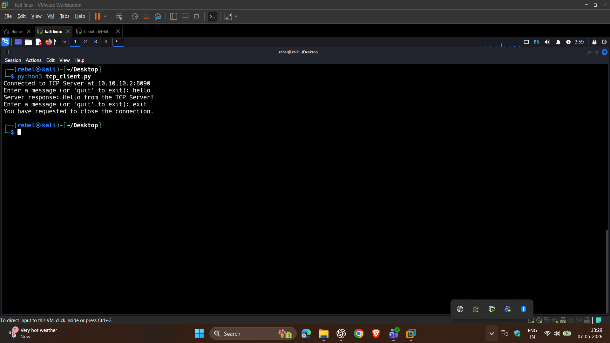
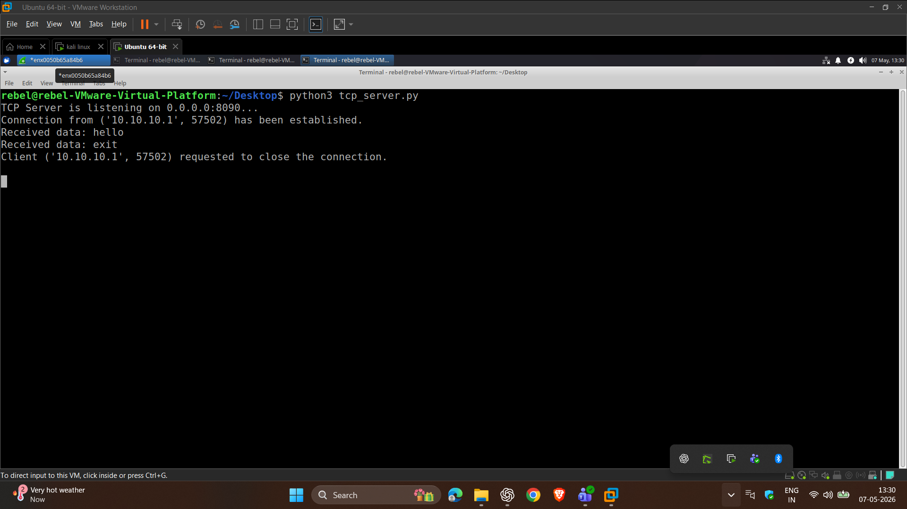
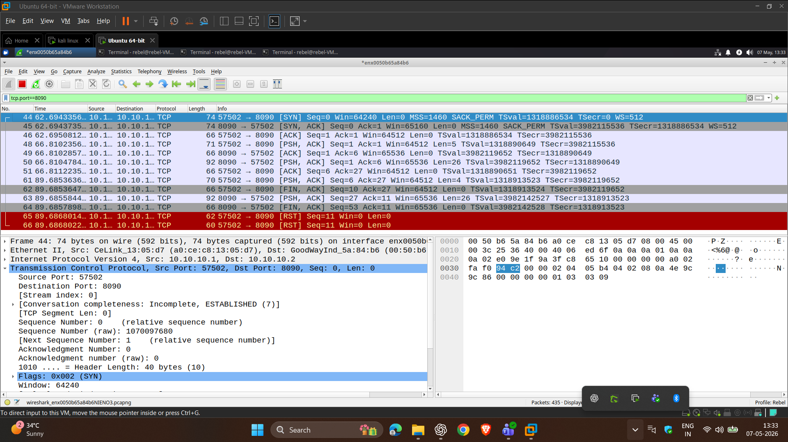

# TCP Client Server Lab

This project is a simple TCP client-server communication lab built using Python sockets.

The server was tested on an Ubuntu virtual machine and the client was tested on a Kali Linux virtual machine inside a custom networking lab environment.

I used this project to understand:
- TCP socket communication
- bind(), listen(), accept()
- recv() and sendall()
- handling continuous client communication
- graceful connection termination
- TCP packet flow in Wireshark

---

## Lab Setup

| Machine | Purpose |
|---|---|
| Ubuntu VM | TCP Server |
| Kali Linux VM | TCP Client |
| Wireshark | Packet Analysis |

Both VMs were connected inside an isolated virtual lab network.

---

## Features

- TCP connection establishment
- Interactive message exchange
- Multiple message handling in one session
- Graceful client disconnect handling
- Exception handling
- Wireshark packet capture analysis

---

## Project Structure

```text
tcp-client-server/
│
├── README.md
├── screenshots/
│   ├── tcp_client_communication.png
│   ├── tcp_server_session.png
│   └── wireshark_tcp_handshake.png
│
└── src/
    ├── tcp_client.py
    └── tcp_server.py
```

---

## What I Learned

One important issue I faced during development was improper loop handling on the server side.

Initially, the server responded only once and then appeared to freeze. After debugging the communication flow and inspecting packets in Wireshark, I fixed the issue by separating:
- the client connection loop
- the continuous message handling loop

This helped me better understand how TCP sessions behave in real communication scenarios.

---

## Screenshots

### TCP Client Communication


### TCP Server Session


### Wireshark TCP Traffic


---

## Technologies Used

- Python
- Linux
- TCP/IP
- Socket Programming
- Wireshark
- VMware Workstation